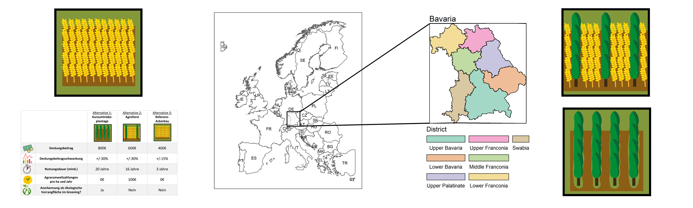

<style type="text/css">
.chart-title {  /* chart_title  */
   font-size: 22px;
</style>

<style type="text/css">
.flowing-content-container {
    font-size: 18px;
}
</style>

<style type="text/css"> .sidebar { overflow: auto; } </style>


<style>
.first-box {
background-color: #F5F5F5
}
</style>


```{r global, include=FALSE, cache=TRUE}
# load data in 'global' chunk so it can be shared by all users of the dashboard
library(tidyverse)
library(sf)
library(mlogit)


df_sim <- readRDS("df_sim.rds")
BYshape <- sf::st_read("regbez_ex.shp")[,"SCH"]
EUshape <- sf::st_read("NUTS_RG_03M_2013_3857_LEVL_0.shp") %>%
  filter(startsWith(NUTS_ID, "DE"))

EUmap <- sf::st_read("NUTS_RG_03M_2013_3857_LEVL_0.shp")
EUmap <- sf::st_transform(EUmap, sf::st_crs(BYshape))
EUmap <- sf::st_crop(sf::st_make_valid(EUmap), 
                 xmin = -15.83454, ymin = 34.80251, 
                 xmax = 34.58835, ymax = 70.09209)

source("SimDroughtFunApp.R")

resCR25cor <- readRDS("res_cor_13_410.rds")
dat <- readRDS("test_app_dat.rds")

X <- model.matrix(resCR25cor)

bi <- as.data.frame(fitted(resCR25cor,type = "parameters")[,-1])

colnames(bi) <- paste0("b_", 
                       stringr::str_replace( 
                         c("SRC", "AC", 
                           names(coef(resCR25cor)[3:27])), "[:]", ""))

bi1 <- as.data.frame(cbind(dat$ID, bi)) %>% dplyr::rename(ID=1)
dat1 <- left_join(dat, bi1, by="ID")
dat <- cbind(dat, bi)
```

About
===

Column {data-width=600}
----------------------------------
### **Tackling Climate Change: Agroforestry Adoption in the Face of Regional Weather Extremes**
*This dashboard supplements the working paper "Tackling Climate Change: Agroforestry Adoption in the Face of Regional Weather Extremes" and provides a platform to gain further insights into the results of the study.*

**Abstract**

The cultivation of agroforestry systems is regarded as an effective strategy to synergistically mitigate and adapt to climate change in the face of an increased occurrence of regional extreme weather events.

This study addresses the question if and under what conditions farmers are likely to adopt agroforestry and wood-based land-use systems in response to regional weather extremes. We conducted a discrete choice experiment to elicit farmers preferences for - and willingness to adopt - agroforestry and wood-based land use systems and combined the results with geo-spatial weather data. Assuming adaptive weather expectations, we regionally simulate land users' dynamic response to extreme weather years in terms of adoption probabilities. 

We find that farmers in our case study region in Southeast Germany have a negative preference for alley cropping and short rotation coppice compared to an exclusively crop-based land use system. However, the results from the simulation of a 2018-like extreme weather year show that alley-cropping systems (i.e. agroforestry) might have a very high probability of being adopted in the medium to long-run under different scenarios, thus enhancing farmers' resilience to climate change.

### 
```{r picture, echo = F, out.width = '100%'}

```


Column {data-width=400}
----------------------------------
### **Interactive Web Application to Simulate the Adoption of Agroforestry and Wood-based Land-use Systems**

<div style="line-height:2">

This application provides the user with a flexible and interactive simulation tool to gain insights into the dynamic adoption behavior of agroforestry and wood-based land-use systems by farmers in Bavaria, Germany. Users can explore and adjust different socioeconomic and weather scenarios to their own needs. 
<br/>
<br/>

**The application provides three simulation tools:**

*(It might take a few moments for the links to load.)*

1. [Replication] simulation: Replicate the scenarios from the working paper.

2. [Full-flex] simulation: Flexibly adjust all simulation parameters.

3. [Comparative] simulation: Compare two individually adjusted scenarios.

</div>

Replication {data-navmenu="Simulation"}
===
Column {data-width=350}
-----------------------------------------------------------------------
### General settings {data-padding=12, .first-box}
```{r}
selectInput('scenario', 'Pre-defined scenario', c("Regular case",
                                                  "Regular case w/ policy support",
                                                  "Regular case w/ technological improvement",
                                                  "Better case for AC/SRC",
                                                  "Ideal case for AC/SRC"))

selectInput('x', 'Region', c("Bavaria",
                             "Upper Bavaria",
                             "Lower Bavaria",
                             "Upper Palatinate",
                             "Upper Franconia",
                             "Central Franconia",
                             "Lower Franconia",
                             "Swabia"))

selectInput('shock_dur', 'Shock duration', 1:5)

selectInput('extreme_year', 'Extreme Weather Year', c(2018, 2003))
```


```{r}
helpText(" ")

helpText(" ")

helpText(" ")

```

### Scenario description (land-use attributes)
```{r}
renderTable({
a <- 
 if (input$scenario=="Regular case") {
  tibble(AC = list(400, 30, 24, 0, "No"),
         SRC = list(400, 30, 24, 0, "No"),
         SQ = list(400, 15, 3, 0, "No"))}
else if (input$scenario=="Regular case w/ policy support") {
  tibble(AC = list(400, 30, 24, 200, "Yes"),
         SRC = list(400, 30, 24,200, "Yes"),
         SQ = list(400, 15, 3, 0, "No"))}
else if (input$scenario=="Regular case w/ technological improvement") {
  tibble(AC = list(400, 30, 16, 0, "No"),
         SRC = list(400, 30, 16, 0, "No"),
         SQ = list(400, 15, 3, 0, "No"))}
else if (input$scenario=="Better case for AC/SRC") {
  tibble(AC = list(600, 22.5, 20, 100, "Yes"),
         SRC = list(600, 22.5, 20, 100, "Yes"),
         SQ = list(400, 15, 3, 0, "No"))}
else if (input$scenario=="Ideal case for AC/SRC") {
  tibble(AC = list(800, 15, 16, 200, "Yes"),
         SRC = list(800, 15, 16, 200, "Yes"),
         SQ = list(400, 15, 3, 0, "No"))}

a$names <- c("Margin contribution (EUR)", 
             "Margin contribution variability (%)",
             "Minimum usefule lifetime (years)", 
             "Payments for ecosystem services (EUR)", 
             "Area eligible for greening premium")

a <- a[, c(4,1,2,3)]
colnames(a) <- c("",
                 "Alley cropping",
                 "Short rotation coppice",
                 "Crop farming")

print(a)
},
striped = T)
```


Column {data-width=650}
-----------------------------------------------------------------------

### Simulation output - Land use probabilities 
```{r fig.width=10,fig.height=11}
renderPlot({
 p <- do.call( rbind, lapply( if (input$x=="Bavaria") {
  "09"}
  else if (input$x=="Upper Bavaria") {
   "091"}
  else if (input$x=="Lower Bavaria") {
   "092"}
  else if (input$x=="Upper Palatinate") {
   "093"}
  else if (input$x=="Upper Franconia") {
   "094"}
  else if (input$x=="Central Franconia") {
   "095"}
  else if (input$x=="Lower Franconia") {
   "096"}
  else if (input$x=="Swabia") {
   "097"},
  function(i)
   
  if (input$scenario=="Regular case") {
   sim_drought(RegBez = i, extreme_year=input$extreme_year,
               
               AC_DB=400, 
               AC_DBVar=30,
               AC_Duruse=24, 
               AC_AES=0, 
               AC_NoGreen=1,
               
               SRC_DB=400,
               SRC_DBVar=30,
               SRC_Duruse=24,
               SRC_AES=0,
               SRC_NoGreen=1,
               
               SQ_DB=400,
               SQ_DBVar=15,
               SQ_Duruse=3,
               
               shock_dur = input$shock_dur)}
  
  else if (input$scenario=="Regular case w/ policy support") {
   sim_drought(RegBez = i, extreme_year=input$extreme_year,
               
               AC_DB=400, 
               AC_DBVar=30,
               AC_Duruse=24, 
               AC_AES=200, 
               AC_NoGreen=0,
               
               SRC_DB=400,
               SRC_DBVar=30,
               SRC_Duruse=24,
               SRC_AES=200,
               SRC_NoGreen=0,
               
               SQ_DB=400,
               SQ_DBVar=15,
               SQ_Duruse=3,
               
               shock_dur = input$shock_dur)}
  
 else if (input$scenario=="Regular case w/ technological improvement") {
   sim_drought(RegBez = i, extreme_year=input$extreme_year,
               
               AC_DB=400,
               AC_DBVar=30,
               AC_Duruse=16, 
               AC_AES=0, 
               AC_NoGreen=1,
               
               SRC_DB=400,
               SRC_DBVar=30,
               SRC_Duruse=16,
               SRC_AES=0,
               SRC_NoGreen=1,
               
               SQ_DB=400,
               SQ_DBVar=15,
               SQ_Duruse=3,
               
               shock_dur = input$shock_dur)}
 
  else if (input$scenario=="Better case for AC/SRC") {
   sim_drought(RegBez = i, extreme_year=input$extreme_year,
               
               AC_DB=600, 
               AC_DBVar=22.5,
               AC_Duruse=20, 
               AC_AES=100, 
               AC_NoGreen=0,
               
               
               SRC_DB=600,
               SRC_DBVar=22.5,
               SRC_Duruse=20,
               SRC_AES=100,
               SRC_NoGreen=0,
               
               SQ_DB=400,
               SQ_DBVar=15,
               SQ_Duruse=3,
               
               shock_dur = input$shock_dur)}
 
  else if (input$scenario=="Ideal case for AC/SRC") {
   sim_drought(RegBez = i, extreme_year=input$extreme_year,
               
               AC_DB=800, 
               AC_DBVar=15,
               AC_Duruse=16, 
               AC_AES=200, 
               AC_NoGreen=0,
               
               SRC_DB=800,
               SRC_DBVar=15,
               SRC_Duruse=16,
               SRC_AES=200,
               SRC_NoGreen=0,
               
               SQ_DB=400,
               SQ_DBVar=15,
               SQ_Duruse=3,
               
               shock_dur = input$shock_dur)})) %>%
  mutate(shock = ifelse(input$shock_dur == 1, "1 extreme year",
                        paste0(input$shock_dur, " consecutive extreme years")),
         name=ifelse(name=="p_shock", "Shocked", "Baseline"),
         RegBez = factor(RegBez,
                         levels = c( "09", "091", "092", "093", 
                                     "094", "095", "096", "097"),
                         labels = c("Bavaria",
                                    "Upper Bavaria",
                                    "Lower Bavaria",
                                    "Upper Palatinate",
                                    "Upper Franconia",
                                    "Central Franconia",
                                    "Lower Franconia",
                                    "Swabia")))  %>%
  # filter(year %in% 0:4) %>%
  ggplot(aes(x=year, y=value)) +
  geom_line(aes(col=ALT, lty=name), size=1.2) +
  scale_x_continuous(expand = c(0, 0),
                     breaks = seq(0, 10, by = 1)) +
  scale_colour_manual(values = c("#CC6666", "#9999CC", "#66CC99")) +
  facet_grid(shock~RegBez) +
  theme_bw(base_size=18) +
  annotate("rect", xmin=0, xmax=as.numeric(input$shock_dur)-.5, 
           ymin=-Inf, ymax=Inf, alpha=0.1, fill="red") +
   theme(panel.grid.minor.x = element_blank(),
         legend.position = "top",
         legend.box="vertical", 
         legend.margin=margin(),
         legend.box.just = 'left',
         legend.justification = 'left',
         strip.text = element_text(size = 18)) +
   labs(x="Year",
        y="Adoption probability",
        colour="Land Use System", 
        lty="Scenario              ") +
 scale_color_brewer(palette="Dark2", type = "qual") +
 scale_linetype_manual(values = c("Baseline" = "dashed", "Shocked" = "solid")) +
 scale_alpha_manual(values = c("Baseline" = 0.66, "Shocked" = 1))+
  ylim(0,1)
 
 print(p)
})
```


Column {data-width=350}
-----------------------------------------------------------------------

### Selected region
```{r}
renderPlot({
 p <-ggplot()+
  geom_sf(data = EUshape, fill = "gray40", color = "gray12", 
          size = 0.2, alpha=0.5) +
  geom_sf(data = BYshape, aes(fill = SCH),fill = "gray40", color = "gray12", 
          size = 0.5, alpha=0.6) +
  geom_sf(data = BYshape[startsWith(BYshape$SCH, 
                                    if (input$x=="Bavaria") {
                                     "09"}
                                    else if (input$x=="Upper Bavaria") {
                                     "091"}
                                    else if (input$x=="Lower Bavaria") {
                                     "092"}
                                    else if (input$x=="Upper Palatinate") {
                                     "093"}
                                    else if (input$x=="Upper Franconia") {
                                     "094"}
                                    else if (input$x=="Central Franconia") {
                                     "095"}
                                    else if (input$x=="Lower Franconia") {
                                     "096"}
                                    else if (input$x=="Swabia") {
                                     "097"}),], fill = "yellow",
          color = "gray12") +
  scale_color_viridis_c() +
  coord_sf(crs = "+proj=laea +lat_0=52 +lon_0=10 +x_0=4321000 +y_0=3210000 +ellps=GRS80 +units=m +no_defs ") +
  theme_minimal()
 
  print(p)
})
```


### Description of the weather shock
```{r}
renderTable({
a <- cbind(
df_sim %>% 
  dplyr::filter(ID==if (input$x=="Bavaria") {
                "09"}
                else if (input$x=="Upper Bavaria") {
                "091"}
                else if (input$x=="Lower Bavaria") {
                "092"}
                else if (input$x=="Upper Palatinate") {
                "093"}
                else if (input$x=="Upper Franconia") {
                "094"}
                else if (input$x=="Central Franconia") {
                "095"}
                else if (input$x=="Lower Franconia") {
                "096"}
                else if (input$x=="Swabia") {
                "097"}) %>% 
  select(ends_with("base30")) %>% 
    unlist,

if (input$extreme_year==2018) {
 df_sim %>% 
  filter(ID=="09") %>% 
  select(ends_with("drought_year")) %>% 
  unlist
} 
else if (input$extreme_year==2003){
 df_sim %>% 
  filter(ID=="09") %>% 
  select(ends_with("drought_year2003")) %>% 
  unlist
}
)

a <- as.data.frame(a)
a$diff <- apply( a , 1 , diff )
 round(a, 2)

a$names <- c("Precipitation (mm/year)",
                  "Average Temperature (°C)",
                  "Dry days (No. of days w/ < 1mm precipitation)",
                  "Heavy rain days (No. of days w/ >20mm precipitation)",
                  "Hot days (No. of days with max. temperature >30°C)")

a <- a[, c(4,1,2,3)]
colnames(a) <- c("",
                 "Long-term average (baseline)",
                 "Extreme weather year (shock)",
                 "Difference")

print(a)
},
striped = T)
```

Full-flex {data-navmenu="Simulation"}
===
## Side Panel {.tabset data-width=300}
--------------------------------------------------------
### General <br/> settings
```{r}
shiny::selectInput('x', 'Region', c("Bavaria",
                             "Upper Bavaria",
                             "Lower Bavaria",
                             "Upper Palatinate",
                             "Upper Franconia",
                             "Central Franconia",
                             "Lower Franconia",
                             "Swabia"))


shiny::selectInput('extreme_year', 'Extreme Weather Year', c(2018, 2003))

selectInput('shock_dur', 'Shock duration', 1:5)
```


### Configure <br/> alley <br/> cropping
```{r}
sliderInput('ac_db', 'Gross Margin (Euro)', min=350, max=850,
            value=600, step=50, round=0)

sliderInput('ac_db_var', 'Gross Margin variability (%)', min=15, max=30,
            value=22, step=1, round=0)

sliderInput('ac_use_dur', 'Minimum use duration (Years)', min=16, max=25,
            value=20, step=1, round=0)

sliderInput('ac_aes', 'Agri-environmental payments (Euro)', min=0, max=200,
            value=100, step=10, round=0)

selectInput('ac_nogreen', 'Greening accepted', c("Yes", "No"))
```

### Configure <br/> short <br/> rotation <br/> coppice
```{r}
sliderInput('src_db', 'Gross Margin (Euro)', min=350, max=850,
            value=600, step=50, round=0)

sliderInput('src_db_var', 'Gross Margin variability (%)', min=15, max=30,
            value=22, step=1, round=0)

sliderInput('src_use_dur', 'Minimum use duration (Years)', min=16, max=25,
            value=20, step=1, round=0)

sliderInput('src_aes', 'Agri-environmental payments (Euro)', min=0, max=200,
            value=100, step=10, round=0)

selectInput('src_nogreen', 'Greening accepted', c("Yes", "No"))
```


### Configure <br/> satus <br/> quo
```{r}
sliderInput('sq_db', 'Gross Margin (Euro)', min=300, max=500,
            value=400, step=50, round=0)

sliderInput('sq_db_var', 'Gross Margin variability (%)', min=10, max=20,
            value=15, step=1, round=0)

sliderInput('sq_use_dur', 'Minimum use duration (Years)', min=1, max=5,
            value=3, step=1, round=0)
```

Agri-environmental payments (Euro)
```{r}
helpText("No agri-environmental payments are paid for the status quo alternative.")
```


Greening accepted
```{r}
helpText("Status quo land use does not qualify for greening.")
```


Column {data-width=650}
-----------------------------------------------------------------------

### Simulation output - Land use probabilities 
```{r fig.width=10,fig.height=11}
renderPlot({
 p <- do.call( rbind, lapply( if (input$x=="Bavaria") {
  "09"}
  else if (input$x=="Upper Bavaria") {
   "091"}
  else if (input$x=="Lower Bavaria") {
   "092"}
  else if (input$x=="Upper Palatinate") {
   "093"}
  else if (input$x=="Upper Franconia") {
   "094"}
  else if (input$x=="Central Franconia") {
   "095"}
  else if (input$x=="Lower Franconia") {
   "096"}
  else if (input$x=="Swabia") {
   "097"},
  function(i) 
   sim_drought(RegBez = i, extreme_year=input$extreme_year,
               
               AC_DB=input$ac_db, 
               AC_DBVar=input$ac_db_var,
               AC_Duruse=input$ac_use_dur, 
               AC_AES=input$ac_aes, 
               AC_NoGreen=ifelse(input$ac_nogreen=="Yes", 0,1),
               
               
               SRC_DB=input$src_db,
               SRC_DBVar=input$src_db_var,
               SRC_Duruse=input$src_use_dur,
               SRC_AES=input$src_aes,
               SRC_NoGreen=ifelse(input$src_nogreen=="Yes", 0,1),
               
               SQ_DB=input$sq_db,
               SQ_DBVar=input$sq_db_var,
               SQ_Duruse=input$sq_use_dur,
               
               shock_dur = input$shock_dur))) %>%
  mutate(shock = ifelse(input$shock_dur == 1, "1 extreme year",
                        paste0(input$shock_dur, " consecutive extreme years")),
         name=ifelse(name=="p_shock", "Shocked", "Baseline"),
         RegBez = factor(RegBez,
                         levels = c( "09", "091", "092", "093", 
                                     "094", "095", "096", "097"),
                         labels = c("Bavaria",
                                    "Upper Bavaria",
                                    "Lower Bavaria",
                                    "Upper Palatinate",
                                    "Upper Franconia",
                                    "Central Franconia",
                                    "Lower Franconia",
                                    "Swabia")))  %>%
  # filter(year %in% 0:4) %>%
  ggplot(aes(x=year, y=value)) +
  geom_line(aes(col=ALT, lty=name), size=1.2) +
  scale_x_continuous(expand = c(0, 0),
                     breaks = seq(0, 10, by = 1)) +
  scale_colour_manual(values = c("#CC6666", "#9999CC", "#66CC99")) +
  facet_grid(shock~RegBez) +
  theme_bw(base_size=18) +
  annotate("rect", xmin=0, xmax=as.numeric(input$shock_dur)-.5, 
           ymin=-Inf, ymax=Inf, alpha=0.1, fill="red") +
   theme(panel.grid.minor.x = element_blank(),
         legend.position = "top",
         legend.box="vertical", 
         legend.margin=margin(),
         legend.box.just = 'left',
         legend.justification = 'left',
         strip.text = element_text(size = 18)) +
   labs(x="Year",
        y="Adoption probability",
        colour="Land use system", 
        lty="Scenario              ") +
 scale_color_brewer(palette="Dark2", type = "qual") +
 scale_linetype_manual(values = c("Baseline" = "dashed", "Shocked" = "solid")) +
 scale_alpha_manual(values = c("Baseline" = 0.66, "Shocked" = 1))+
  ylim(0,1)
 
 print(p)
})
```


Column {data-width=350}
-----------------------------------------------------------------------

### Selected region
```{r}
renderPlot({
 p <-ggplot()+
  geom_sf(data = EUshape, fill = "gray40", color = "gray12", 
          size = 0.2, alpha=0.5) +
  geom_sf(data = BYshape, aes(fill = SCH),fill = "gray40", color = "gray12", 
          size = 0.5, alpha=0.6) +
  geom_sf(data = BYshape[startsWith(BYshape$SCH, 
                                    if (input$x=="Bavaria") {
                                     "09"}
                                    else if (input$x=="Upper Bavaria") {
                                     "091"}
                                    else if (input$x=="Lower Bavaria") {
                                     "092"}
                                    else if (input$x=="Upper Palatinate") {
                                     "093"}
                                    else if (input$x=="Upper Franconia") {
                                     "094"}
                                    else if (input$x=="Central Franconia") {
                                     "095"}
                                    else if (input$x=="Lower Franconia") {
                                     "096"}
                                    else if (input$x=="Swabia") {
                                     "097"}),], fill = "yellow",
          color = "gray12") +
  scale_color_viridis_c() +
  coord_sf(crs = "+proj=laea +lat_0=52 +lon_0=10 +x_0=4321000 +y_0=3210000 +ellps=GRS80 +units=m +no_defs ") +
  theme_minimal()
 
  print(p)
})
```


### Description of the weather shock
```{r}
renderTable({
a <- cbind(
df_sim %>% 
  dplyr::filter(ID==if (input$x=="Bavaria") {
                "09"}
                else if (input$x=="Upper Bavaria") {
                "091"}
                else if (input$x=="Lower Bavaria") {
                "092"}
                else if (input$x=="Upper Palatinate") {
                "093"}
                else if (input$x=="Upper Franconia") {
                "094"}
                else if (input$x=="Central Franconia") {
                "095"}
                else if (input$x=="Lower Franconia") {
                "096"}
                else if (input$x=="Swabia") {
                "097"}) %>% 
  select(ends_with("base30")) %>% 
    unlist,

if (input$extreme_year==2018) {
 df_sim %>% 
  filter(ID=="09") %>% 
  select(ends_with("drought_year")) %>% 
  unlist
} 
else if (input$extreme_year==2003){
 df_sim %>% 
  filter(ID=="09") %>% 
  select(ends_with("drought_year2003")) %>% 
  unlist
}
)

a <- as.data.frame(a)
a$diff <- apply( a , 1 , diff )
 round(a, 2)

a$names <- c("Precipitation (mm/year)",
                  "Average Temperature (°C)",
                  "Dry days (No. of days w/ < 1mm precipitation)",
                  "Heavy rain days (No. of days w/ >20mm precipitation)",
                  "Hot days (No. of days with max. temperature >30°C)")

a <- a[, c(4,1,2,3)]
colnames(a) <- c("",
                 "Long-term average (baseline)",
                 "Extreme weather year (shock)",
                 "Difference")

print(a)
},
striped = T)
```


Comparative {data-navmenu="Simulation"}
===
## Side Panel 1 {.tabset data-width=250}
--------------------------------------------------------
### General <br/> settings
<font size="6"> Simulation  1 </font> 
```{r}
shiny::selectInput('x1', 'Region', c("Bavaria",
                             "Upper Bavaria",
                             "Lower Bavaria",
                             "Upper Palatinate",
                             "Upper Franconia",
                             "Central Franconia",
                             "Lower Franconia",
                             "Swabia"))


shiny::selectInput('extreme_year1', 'Extreme Weather Year', c(2018, 2003))

selectInput('shock_dur1', 'Shock duration', 1:5)
```

$$\\[.05in]$$
<font size="6"> Simulation  2 </font> 
```{r}
shiny::selectInput('x2', 'Region', c("Bavaria",
                             "Upper Bavaria",
                             "Lower Bavaria",
                             "Upper Palatinate",
                             "Upper Franconia",
                             "Central Franconia",
                             "Lower Franconia",
                             "Swabia"))

shiny::selectInput('extreme_year2', 'Extreme Weather Year', c(2018, 2003))

selectInput('shock_dur2', 'Shock duration', 1:5)
# numericInput("shock_dur", "Shock Duration (Years)", 1, min = 1, max = 5)

# actionButton("reset_input", "Reset Inputs")
# sliderInput('sampleSize', 'Sample Size', min=1, max=10,
#             value=10, step=1, round=0)
# 
# observeEvent(input$reset_input, {
#       shinyjs::reset("side-panel")
#     })
```


### Configure <br/> alley <br/> cropping
<font size="6"> Simulation  1 </font> 

```{r}
sliderInput('ac_db1', 'Gross Margin (Euro)', min=350, max=850,
            value=600, step=50, round=0)

sliderInput('ac_db_var1', 'Gross Margin variability (%)', min=15, max=30,
            value=22, step=1, round=0)

sliderInput('ac_use_dur1', 'Minimum use duration (Years)', min=16, max=25,
            value=20, step=1, round=0)

sliderInput('ac_aes1', 'Agri-environmental payments (Euro)', min=0, max=200,
            value=100, step=10, round=0)

selectInput('ac_nogreen1', 'Greening accepted', c("Yes", "No"))
```

$$\\[.05in]$$
<font size="6"> Simulation  2 </font> 
```{r}
helpText(" ")
```

```{r}
######################
sliderInput('ac_db2', 'Gross Margin (Euro)', min=350, max=850,
            value=600, step=50, round=0)

sliderInput('ac_db_var2', 'Gross Margin variability (%)', min=15, max=30,
            value=22, step=1, round=0)

sliderInput('ac_use_dur2', 'Minimum use duration (Years)', min=16, max=25,
            value=20, step=1, round=0)

sliderInput('ac_aes2', 'Agri-environmental payments (Euro)', min=0, max=200,
            value=100, step=10, round=0)

selectInput('ac_nogreen2', 'Greening accepted', c("Yes", "No"))
```

### Configure <br/> short <br/> rotation <br/> coppice
<font size="6"> Simulation  1 </font> 


```{r}
sliderInput('src_db1', 'Gross Margin (Euro)', min=350, max=850,
            value=600, step=50, round=0)

sliderInput('src_db_var1', 'Gross Margin variability (%)', min=15, max=30,
            value=22, step=1, round=0)

sliderInput('src_use_dur1', 'Minimum use duration (Years)', min=16, max=25,
            value=20, step=1, round=0)

sliderInput('src_aes1', 'Agri-environmental payments (Euro)', min=0, max=200,
            value=100, step=10, round=0)

selectInput('src_nogreen1', 'Greening accepted', c("Yes", "No"))
```

<font size="6"> Simulation  2 </font> 

```{r}
############################
sliderInput('src_db2', 'Gross Margin (Euro)', min=350, max=850,
            value=600, step=50, round=0)

sliderInput('src_db_var2', 'Gross Margin variability (%)', min=15, max=30,
            value=22, step=1, round=0)

sliderInput('src_use_dur2', 'Minimum use duration (Years)', min=16, max=25,
            value=20, step=1, round=0)

sliderInput('src_aes2', 'Agri-environmental payments (Euro)', min=0, max=200,
            value=100, step=10, round=0)

selectInput('src_nogreen2', 'Greening accepted', c("Yes", "No"))
```

Greening accepted
```{r}
helpText("Status quo land use does not qualify for greening.")
```

### Configure <br/> satus <br/> quo
<font size="6"> Simulation  1 </font> 
```{r}
sliderInput('sq_db1', 'Gross Margin (Euro)', min=300, max=500,
            value=400, step=50, round=0)

sliderInput('sq_db_var1', 'Gross Margin variability (%)', min=10, max=20,
            value=15, step=1, round=0)

sliderInput('sq_use_dur1', 'Minimum use duration (Years)', min=1, max=5,
            value=3, step=1, round=0)
```

<font size="6"> Simulation  2 </font> 
```{r}
########################
sliderInput('sq_db2', 'Gross Margin (Euro)', min=300, max=500,
            value=400, step=50, round=0)

sliderInput('sq_db_var2', 'Gross Margin variability (%)', min=10, max=20,
            value=15, step=1, round=0)

sliderInput('sq_use_dur2', 'Minimum use duration (Years)', min=1, max=5,
            value=3, step=1, round=0)
```

<font size="4"> Simulation  1/2 </font> 

Agri-environmental payments (Euro)
```{r}
helpText("No agri-environmental payments are paid for the status quo alternative.")
```


Greening accepted
```{r}
helpText("Status quo land use does not qualify for greening.")
```

Column {data-width=650}
-----------------------------------------------------------------------

### Simulation output - Land use probabilities
```{r fig.width=10,fig.height=11}
library(patchwork)
renderPlot({
 p <-   
  (do.call( rbind, lapply( if (input$x1=="Bavaria") {
  "09"}
  else if (input$x1=="Upper Bavaria") {
   "091"}
  else if (input$x1=="Lower Bavaria") {
   "092"}
  else if (input$x1=="Upper Palatinate") {
   "093"}
  else if (input$x1=="Upper Franconia") {
   "094"}
  else if (input$x1=="Central Franconia") {
   "095"}
  else if (input$x1=="Lower Franconia") {
   "096"}
  else if (input$x1=="Swabia") {
   "097"},
  function(i)
   sim_drought(RegBez = i, extreme_year=input$extreme_year1,

               AC_DB=input$ac_db1,
               AC_DBVar=input$ac_db_var1,
               AC_Duruse=input$ac_use_dur1,
               AC_AES=input$ac_aes1,
               AC_NoGreen=ifelse(input$ac_nogreen1=="Yes", 0,1),


               SRC_DB=input$src_db1,
               SRC_DBVar=input$src_db_var1,
               SRC_Duruse=input$src_use_dur1,
               SRC_AES=input$src_aes1,
               SRC_NoGreen=ifelse(input$src_nogreen1=="Yes", 0,1),

               SQ_DB=input$sq_db1,
               SQ_DBVar=input$sq_db_var1,
               SQ_Duruse=input$sq_use_dur1,

               shock_dur = input$shock_dur1))) %>%
  mutate(shock = ifelse(input$shock_dur == 1, "1 extreme year",
                        paste0(input$shock_dur, " consecutive extreme years")),
         name=ifelse(name=="p_shock", "Shocked", "Baseline"),
         RegBez = factor(RegBez,
                         levels = c( "09", "091", "092", "093",
                                     "094", "095", "096", "097"),
                         labels = c("Bavaria",
                                    "Upper Bavaria",
                                    "Lower Bavaria",
                                    "Upper Palatinate",
                                    "Upper Franconia",
                                    "Central Franconia",
                                    "Lower Franconia",
                                    "Swabia"))) %>%
  # filter(year %in% 0:4) %>%
  ggplot(aes(x=year, y=value)) +
  geom_line(aes(col=ALT, lty=name), size=1.2) +
  scale_x_continuous(expand = c(0, 0),
                     breaks = seq(0, 10, by = 1)) +
  scale_colour_manual(values = c("#CC6666", "#9999CC", "#66CC99")) +
  facet_grid(shock~RegBez) +
  theme_bw(base_size=18) +
  annotate("rect", xmin=0, xmax=as.numeric(input$shock_dur)-.5,
           ymin=-Inf, ymax=Inf, alpha=0.1, fill="red") +
   theme(panel.grid.minor.x = element_blank(),
         legend.position = "top",
         legend.box="vertical",
         legend.margin=margin(),
         legend.box.just = 'left',
         legend.justification = 'left',
         strip.text = element_text(size = 18),
         plot.title = element_text(size = 30)) +
   labs(x="Year",
        y="Adoption probability",
        colour="Land use system",
        lty="Scenario              ") +
 scale_color_brewer(palette="Dark2", type = "qual") +
 scale_linetype_manual(values = c("Baseline" = "dashed", "Shocked" = "solid")) +
 scale_alpha_manual(values = c("Baseline" = 0.66, "Shocked" = 1))+
  ylim(0,1) +
   ggtitle("Simulation 1") |
  
 do.call( rbind, lapply( if (input$x2=="Bavaria") {
  "09"}
  else if (input$x2=="Upper Bavaria") {
   "091"}
  else if (input$x2=="Lower Bavaria") {
   "092"}
  else if (input$x2=="Upper Palatinate") {
   "093"}
  else if (input$x2=="Upper Franconia") {
   "094"}
  else if (input$x2=="Central Franconia") {
   "095"}
  else if (input$x2=="Lower Franconia") {
   "096"}
  else if (input$x2=="Swabia") {
   "097"},
  function(i)
   sim_drought(RegBez = i, extreme_year=input$extreme_year2,

               AC_DB=input$ac_db2,
               AC_DBVar=input$ac_db_var2,
               AC_Duruse=input$ac_use_dur2,
               AC_AES=input$ac_aes2,
               AC_NoGreen=ifelse(input$ac_nogreen1=="Yes", 0,1),
               
               
               SRC_DB=input$src_db2,
               SRC_DBVar=input$src_db_var2,
               SRC_Duruse=input$src_use_dur2,
               SRC_AES=input$src_aes2,
               SRC_NoGreen=ifelse(input$src_nogreen2=="Yes", 0,1),
               
               SQ_DB=input$sq_db2,
               SQ_DBVar=input$sq_db_var2,
               SQ_Duruse=input$sq_use_dur2,
               
               shock_dur = input$shock_dur2))) %>%
   mutate(shock = ifelse(input$shock_dur2 == 1, "1 extreme year",
                         paste0(input$shock_dur2, " consecutive extreme years")),
          name=ifelse(name=="p_shock", "Shocked", "Baseline"),
          RegBez = factor(RegBez,
                          levels = c( "09", "091", "092", "093",
                                      "094", "095", "096", "097"),
                          labels = c("Bavaria",
                                     "Upper Bavaria",
                                     "Lower Bavaria",
                                     "Upper Palatinate",
                                     "Upper Franconia",
                                     "Central Franconia",
                                     "Lower Franconia",
                                     "Swabia"))) %>%
 ggplot(aes(x=year, y=value)) +
  geom_line(aes(col=ALT, lty=name), size=1.2) +
  scale_x_continuous(expand = c(0, 0),
                     breaks = seq(0, 10, by = 1)) +
  scale_colour_manual(values = c("#CC6666", "#9999CC", "#66CC99")) +
  facet_grid(shock~RegBez) +
  theme_bw(base_size=18) +
  annotate("rect", xmin=0, xmax=as.numeric(input$shock_dur)-.5,
           ymin=-Inf, ymax=Inf, alpha=0.1, fill="red") +
   ggtitle("Simulation 2") +
  theme(panel.grid.minor.x = element_blank(),
        legend.position = "top",
        legend.box="vertical",
        legend.margin=margin(),
        legend.box.just = 'left',
        legend.justification = 'left',
        strip.text = element_text(size = 18),
         plot.title = element_text(size = 30)) +
  labs(x="Year",
       y="",
       colour="Land Use System",
       lty="Scenario              ") +
 scale_color_brewer(palette="Dark2", type = "qual") +
 scale_linetype_manual(values = c("Baseline" = "dashed", "Shocked" = "solid")) +
 scale_alpha_manual(values = c("Baseline" = 0.66, "Shocked" = 1))+
  ylim(0,1)) +
  plot_layout(guides = "collect")  & theme(legend.position = "bottom",
                                           legend.box="vertical",
                                           legend.margin=margin(),
                                           legend.box.just = 'left',
                                           legend.justification = 'left')
 print(p)
})
```